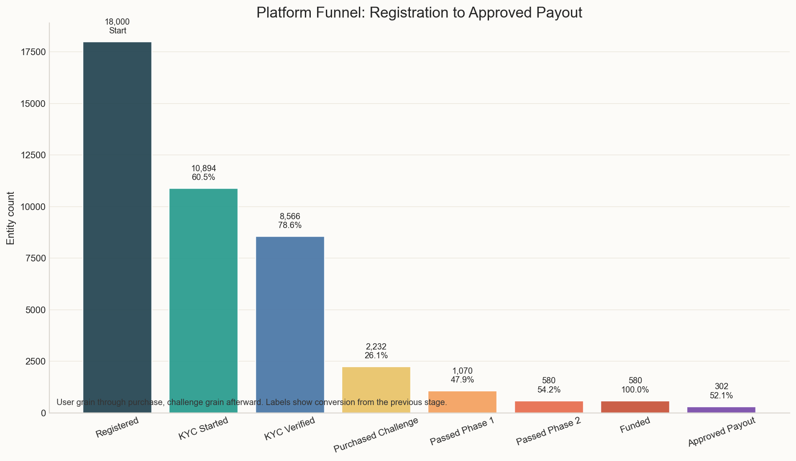
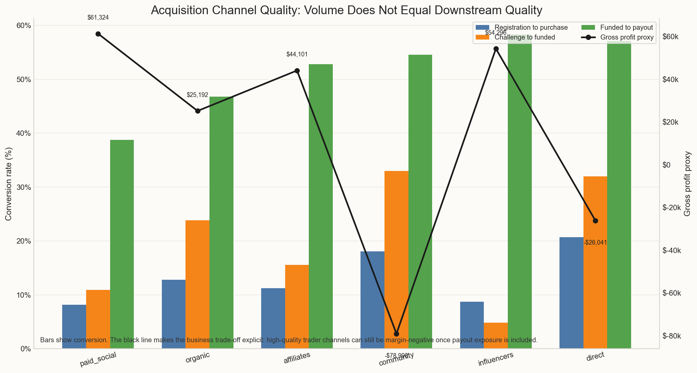
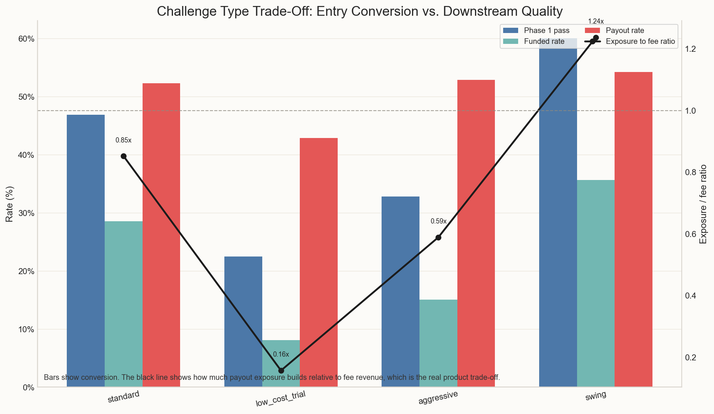
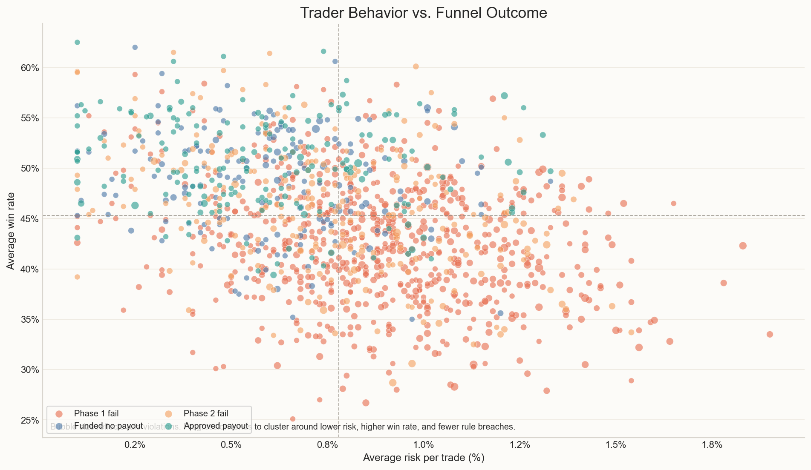

# prop-trading-funnel-analytics

*Русская версия: [README_RU.md](README_RU.md)*

Portfolio case study for a challenge-based prop trading platform. The project analyzes the full funnel from registration to funded payout and explicitly treats downstream trader quality and payout exposure as core business constraints, not afterthoughts.

This repository is built as a reproducible analytics project rather than a one-off notebook:

- synthetic data generation in Python
- analytical SQL in DuckDB
- chart generation in Python
- a lightweight notebook walkthrough
- a short interview talking-points guide
- saved outputs for recruiter review

## Business Context

Prop trading challenge platforms do not win by maximizing registrations or first purchases alone. A cohort that converts well at the top of the funnel can still destroy economics if it:

- clears evaluation at a high rate
- reaches funded quickly
- generates large approved or pending payouts relative to fee revenue

The operating question is therefore not just “who converts?”, but “which users create value, which users create liability, and where does the funnel stop being attractive for the business?”

## Problem Statement

Analyze a synthetic 2025 dataset for a challenge-based prop trading platform across the funnel:

`registration -> KYC -> challenge purchase -> phase 1 -> phase 2 -> funded -> payout`

Main questions:

1. Where are the biggest funnel breaks?
2. Which acquisition channels produce the best traders, not just the most signups?
3. Which challenge types balance conversion with downstream quality?
4. Which countries and experience segments convert well into funded traders?
5. Which funded segments generate the highest payout exposure?
6. What trader behavior patterns are associated with progression or failure?
7. Which segments look attractive at the top of the funnel but weak when payout exposure is included?

## Snapshot

Generated sample:

- 18,000 registrations
- 8,566 KYC-verified users
- 2,232 purchasing users
- 2,676 challenge purchases
- 580 funded challenges
- 302 approved payout challenges

Top-level funnel:

- KYC start rate: 60.5% of registrations
- KYC verified rate: 47.6% of registrations
- Verified-to-purchase conversion: 26.1%
- Phase 1 pass rate: 47.9% of purchased challenges
- Phase 2 pass rate: 54.2% of phase 1 passes
- Approved payout rate: 52.1% of funded challenges



## Dataset Schema

### `users.csv`

One row per registration.

| Column | Description |
| --- | --- |
| `user_id` | Unique user identifier |
| `registration_date` | Initial signup date |
| `country` | User country |
| `acquisition_channel` | `organic`, `paid_social`, `affiliates`, `influencers`, `direct`, `community` |
| `device_type` | Desktop, mobile, or tablet |
| `platform_language` | Platform language used at registration |
| `age_bucket` | Age bucket |
| `prior_trading_experience` | `none`, `beginner`, `intermediate`, `advanced` |

### `kyc_events.csv`

One row per user KYC state.

| Column | Description |
| --- | --- |
| `user_id` | User identifier |
| `kyc_started_at` | Timestamp when KYC started |
| `kyc_completed_at` | Timestamp when KYC completed |
| `kyc_status` | `verified`, `rejected`, `abandoned`, `pending`, `not_started` |

### `challenges.csv`

One row per purchased challenge.

| Column | Description |
| --- | --- |
| `challenge_id` | Challenge identifier |
| `user_id` | Purchasing user |
| `purchase_date` | Challenge purchase date |
| `challenge_type` | `standard`, `aggressive`, `swing`, `low_cost_trial` |
| `price_usd` | Challenge fee |
| `account_size` | Simulated account size |
| `promo_code_used` | Promo code or null |

### `challenge_progress.csv`

One row per challenge progression state.

| Column | Description |
| --- | --- |
| `challenge_id` | Challenge identifier |
| `phase_1_status` | Phase 1 outcome |
| `phase_1_completed_at` | Phase 1 terminal timestamp |
| `phase_2_status` | Phase 2 outcome or `not_reached` |
| `phase_2_completed_at` | Phase 2 terminal timestamp |
| `funded_at` | Timestamp when challenge becomes funded |
| `failed_reason` | Main failure reason if not funded |
| `days_to_fail_or_pass` | Total time to terminal stage or funded |

### `payouts.csv`

One row per payout request.

| Column | Description |
| --- | --- |
| `payout_id` | Payout identifier |
| `challenge_id` | Source challenge |
| `user_id` | User identifier |
| `payout_requested_at` | Request timestamp |
| `payout_amount_usd` | Requested payout amount |
| `payout_status` | `approved`, `under_review`, or `rejected` |

### `trader_behavior.csv`

One row per purchasing user.

| Column | Description |
| --- | --- |
| `user_id` | User identifier |
| `avg_daily_sessions` | Mean daily platform sessions |
| `avg_trade_duration_minutes` | Mean trade holding time |
| `avg_risk_per_trade_pct` | Average risk per trade |
| `avg_win_rate` | Mean win rate |
| `avg_rr` | Average risk-reward ratio |
| `max_drawdown_pct` | Max drawdown proxy |
| `rule_violations_count` | Number of rule violations |
| `inactivity_days_after_purchase` | Inactivity proxy after first challenge purchase |

## Assumptions

- The data is synthetic but internally consistent. Users can fail KYC, buy more than one challenge, pass phases, reach funded, and request payouts.
- Prior experience matters but is not deterministic. Advanced users perform better on average, but noise and behavior still create overlap.
- `payout_exposure` is defined as approved plus under-review payout dollars. It is used as a business risk proxy.
- `gross_profit_proxy` is defined as challenge fee revenue minus payout exposure. It intentionally excludes CAC, support cost, hedging, and fixed overhead.
- After purchase, the funnel is challenge-based rather than user-based. This is common for prop firms because repeat attempts matter.

## Metric Definitions

- `CR`: Conversion rate from one stage to the next.
- `Funded conversion`: Share of purchased challenges that reach funded status.
- `Payout rate`: Share of funded challenges with at least one approved payout.
- `Payout exposure`: Approved plus under-review payout dollars, used as a direct liability proxy.
- `Churn / inactivity proxy`: `inactivity_days_after_purchase`, a synthetic measure of disengagement after buying a challenge.

## Methodology

### 1. Synthetic data generation

- Sample registrations across realistic countries, channels, ages, devices, languages, and experience buckets.
- Simulate KYC progression with channel, device, compliance, and engagement effects.
- Simulate challenge purchases with repeat attempts, challenge-type selection, and promo usage.
- Generate user-level trader behavior metrics tied to skill, discipline, engagement, and risk.
- Simulate challenge progression through phase 1, phase 2, funded, and payout events.

### 2. SQL analytics

The `sql/` directory contains seven production-style queries:

- `01_overall_funnel.sql`
- `02_funnel_by_acquisition_channel.sql`
- `03_funnel_by_challenge_type.sql`
- `04_funded_payout_analysis.sql`
- `05_cohort_analysis_by_registration_month.sql`
- `06_trader_segment_comparison.sql`
- `07_stage_timing.sql`

These scripts use CTEs and clear naming to build reusable analytical tables in DuckDB.

### 3. Python reporting

Python in `src/analysis.py` reads the generated outputs and saves seven charts to `outputs/`:

- funnel stage chart
- conversion by acquisition channel
- conversion by challenge type
- cohort progression heatmap
- payout exposure by segment
- trader behavior vs funnel outcomes
- stage timing (median days between transitions)

## Key Findings

### 1. The funnel breaks hardest at KYC start and post-KYC monetization

- Only **60.5%** of registrations start KYC.
- Only **47.6%** of registrations end up KYC verified.
- Only **26.1%** of verified users buy a challenge.

Interpretation: the biggest commercial leak is not evaluation difficulty alone. The platform loses a large share of users before monetization even begins.

### 2. The channels that produce the best traders are not the ones with the best unit economics

Channel comparison:

- `direct` has **20.7%** registration-to-purchase conversion and **32.0%** purchase-to-funded conversion.
- `community` has **18.1%** registration-to-purchase conversion and **33.0%** purchase-to-funded conversion.
- Both are much stronger trader-quality channels than `paid_social` (**10.9%** funded from purchase) or `influencers` (**4.8%**).

But the business trade-off flips downstream:

- `community` shows **-$79.0k** gross profit proxy.
- `direct` shows **-$26.0k** gross profit proxy.
- `paid_social` remains positive on the proxy because weak downstream quality suppresses payout liability.

The takeaway is uncomfortable: the channels worth protecting for trader quality are also the channels that create the most payout liability. Optimizing on registrations or funded conversion alone would point in the wrong direction.



### 3. Low-cost trials help acquisition, but they are not a quality product

- `low_cost_trial` produces **693** challenges, second only to `standard`.
- It funds only **8.1%** of purchased challenges.
- Its payout exposure ratio is low because account sizes and downstream quality are both limited.

Trials generate volume and some fee revenue, but their downstream numbers are weak enough that they should be reported separately from the main challenge product — mixing them into aggregate conversion metrics makes the platform look worse than it is on quality and better than it is on volume.

### 4. Swing accounts create the clearest liability trade-off

- `swing` has the highest funded conversion at **35.7%**.
- It also carries the worst gross profit proxy at **-$66.9k**.
- Its payout exposure-to-fee ratio is **1.24x**, meaning exposure exceeds fee revenue in aggregate.

By contrast:

- `aggressive` is the strongest product on the gross profit proxy at **$82.5k**
- but it still carries a high funded-to-payout rate of **52.9%**

Interpretation: higher funded conversion is not inherently good. The relevant question is whether fee pricing covers the payout profile of the cohort that passes.



### 5. Prior trading experience matters a lot in later stages

Funded conversion by experience:

- `advanced`: **44.2%**
- `intermediate`: **25.5%**
- `beginner`: **6.3%**
- `none`: **1.4%**

Approved payout rate by challenge:

- `advanced`: **24.9%**
- `intermediate`: **12.3%**
- `beginner`: **2.8%**
- `none`: **0.6%**

Interpretation: experience is strongly predictive of downstream quality and downstream liability. It should be treated as both a growth segmentation variable and a payout-risk segmentation variable.

### 6. Country performance is mixed and intentionally noisy

Among countries with at least 70 challenges, the strongest funded conversion rates in this simulation come from:

- Poland
- France
- United Arab Emirates
- Spain
- Germany
- Canada

This is useful for segmentation, but the signal should be treated as directional rather than policy-grade. Country effects in real prop data often mix regulation, payment friction, local communities, and channel mix.

### 7. Behavior patterns separate progressors from early failures

Average behavior by outcome:

- Approved payout users: **0.60%** risk per trade, **50%** win rate, **1.29** average RR, **0.50** rule violations
- Phase 1 failures: **0.89%** risk per trade, **42%** win rate, **1.04** average RR, **1.15** rule violations

The separation between outcome groups is visible early. This matters because it means a risk or support team could flag high-risk behavior in Phase 1 before funding decisions are made — though the overlap between groups means no single metric is a reliable classifier on its own.



### 8. Some segment combinations are actively misleading at the top of the funnel

Examples flagged by the segment comparison:

- `direct | advanced`
- `community | advanced`
- `organic | advanced`
- `affiliates | advanced`

These segments convert and fund extremely well, but their payout exposure is large enough that they become unattractive on the gross profit proxy.

### 9. Stage timing reveals where friction accumulates — and where fast progression is a flag

Median days between key transitions (see `outputs/stage_timing.csv` for IQR):

- Registration → KYC verified: varies, but the IQR spread is wide — a long tail of slow completions points to friction in the KYC flow itself rather than user disinterest.
- KYC verified → first purchase: the P75 is notably higher than the median, meaning a meaningful share of verified users take weeks to convert. These are prime candidates for re-engagement nudges.
- Purchase → Phase 1 outcome: traders who fail do so faster than those who pass. Quick failures are often a risk-sizing problem (breach the drawdown limit early) rather than a skill problem.
- Phase 1 → Phase 2 outcome: similar pattern — fast failures probably mean the same drawdown issue, not more time exposure.
- Funded → first payout request: the IQR here is what the finance team cares about most. A wide spread means payout liability is hard to schedule; a tight, short window means the funded book turns over quickly.

Interpretation: timing data complements conversion rates. High conversion at a stage is good; fast failure at a stage is a specific type of signal worth breaking out separately.

## Revenue Impact of Funnel Improvements

Converting drop-off rates into rough dollar terms helps prioritize where effort goes.

**KYC-to-purchase conversion (26.1% of verified users)**

This is the platform's largest addressable gap before any new marketing spend. The current base of 8,566 KYC-verified users already exists — improving purchase conversion by one percentage point yields approximately 86 additional challenge purchases. At the average challenge fee in this dataset (~$250), that is roughly **$21,500 per percentage point improvement**, with zero additional CAC.

A 3-point improvement (26% → 29%) would translate to ~$64,500 in incremental fee revenue from the existing verified base. The first question to answer before acting on this: is the holdout explained by price sensitivity, UX friction at checkout, or users who verified but were never seriously intent on buying?

**KYC start rate (60.5% of registrations)**

39.5% of registrations never begin KYC. A share of that is bots and casual browsers, but improving the start rate from 60.5% to 65% adds roughly 810 additional KYC starters. At the current verified completion rate (~78.7%), that is ~638 additional verified users — who then flow through the purchase funnel at 26.1%, yielding approximately 166 more purchasers and ~$41,500 in fee revenue.

**Note:** these are order-of-magnitude estimates. The actual impact depends on whether drop-off is uniform across channels (it is not — `influencer` and `paid_social` users complete KYC at lower rates). Segmented improvement would have a different cost and different downstream quality profile.

## Business Recommendations

### Growth

- Do not optimize acquisition on registrations or first purchases alone.
- Treat `organic` as the most balanced scale channel in this simulation: respectable quality with positive gross profit proxy.
- Keep `low_cost_trial` as a lead-generation product, but separate it from trader-quality reporting.

### Risk

- Put tighter funded-book monitoring on `community | advanced` and `direct | advanced`.
- Use payout exposure per funded challenge as a standing risk KPI next to payout rate.
- Review under-review payout share for advanced paid and partner cohorts before scaling them.

### Product

- Reprice or tighten `swing` if it remains structurally negative after exposure.
- Keep `aggressive` only with deliberate risk controls; its short-term economics look good here, but it still creates a material payout tail.
- Consider differentiated progression or payout policies by challenge type rather than a one-size-fits-all funded model.

## Limitations

- This is a synthetic dataset. The relationships are designed to be realistic, not empirically measured from a live prop firm.
- The business proxy excludes CAC, support cost, chargebacks, hedging, and fixed overhead.
- Country results are sensitive to the simulated channel and experience mix.
- The payout model uses approved plus under-review payout dollars as exposure, which is useful analytically but not a full treasury or risk model.

## Repository Structure

```text
prop-trading-funnel-analytics/
├── INTERVIEW_WALKTHROUGH.md
├── README.md
├── requirements.txt
├── .gitignore
├── data/
├── notebooks/
├── outputs/
├── sql/
└── src/
```

## How To Run

Use Python 3.11.

```bash
python3.11 -m venv .venv
source .venv/bin/activate
pip install -r requirements.txt
python -m src.pipeline
```

Pipeline outputs:

- synthetic CSV data in `data/`
- DuckDB analytical database in `data/prop_trading_funnel.duckdb`
- SQL result tables in `outputs/*.csv`
- six chart PNGs in `outputs/`
- a short executive summary in `outputs/summary.md`

The notebook in `notebooks/` is a walkthrough layer on top of the pipeline, not the core implementation.

If you want to use the repo in interviews, start with `INTERVIEW_WALKTHROUGH.md`.
